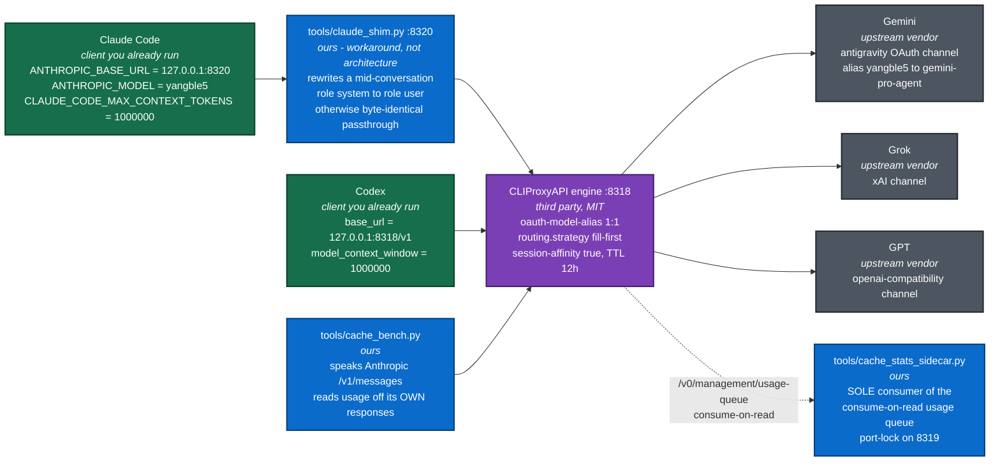
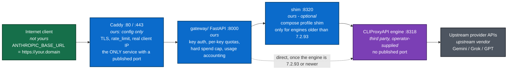
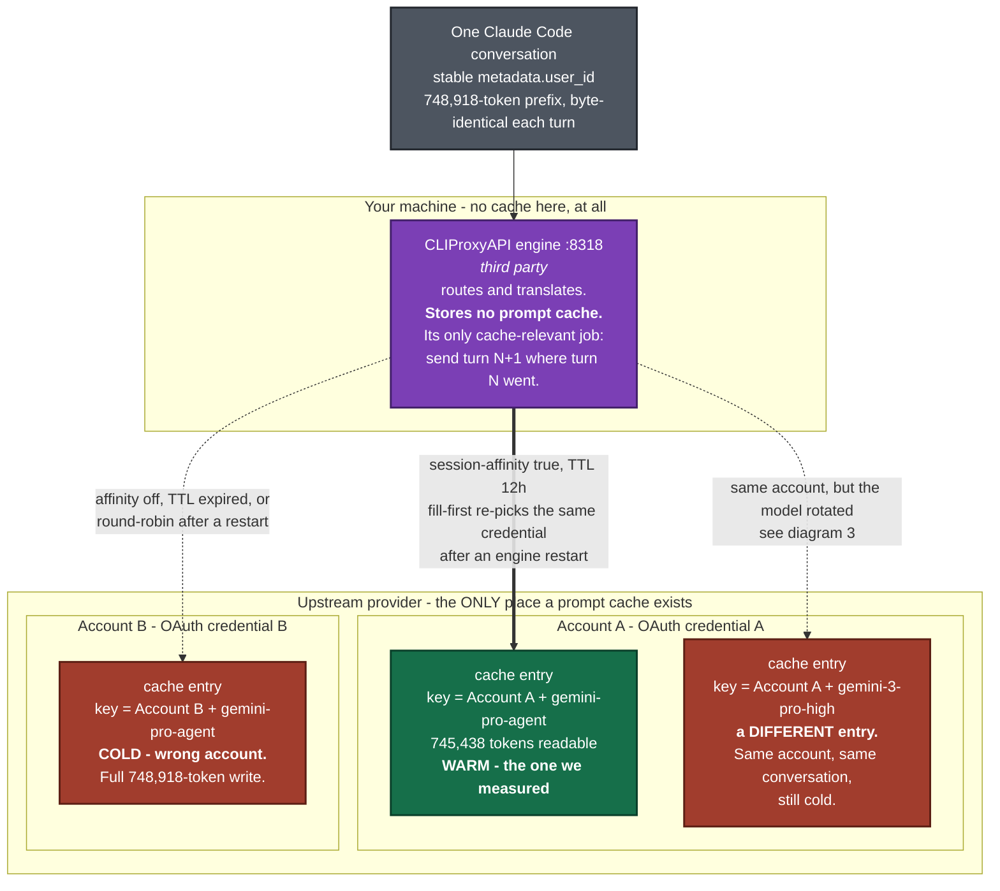
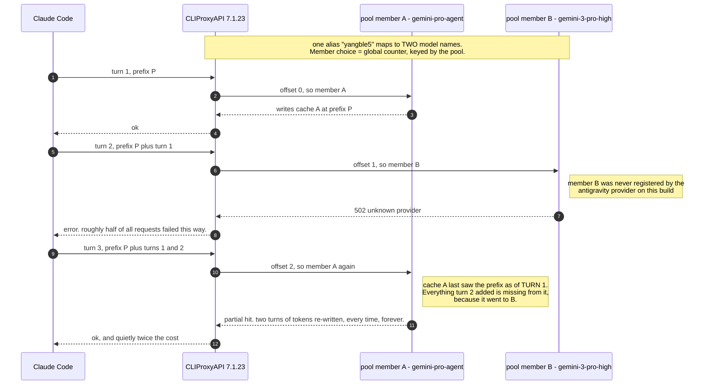
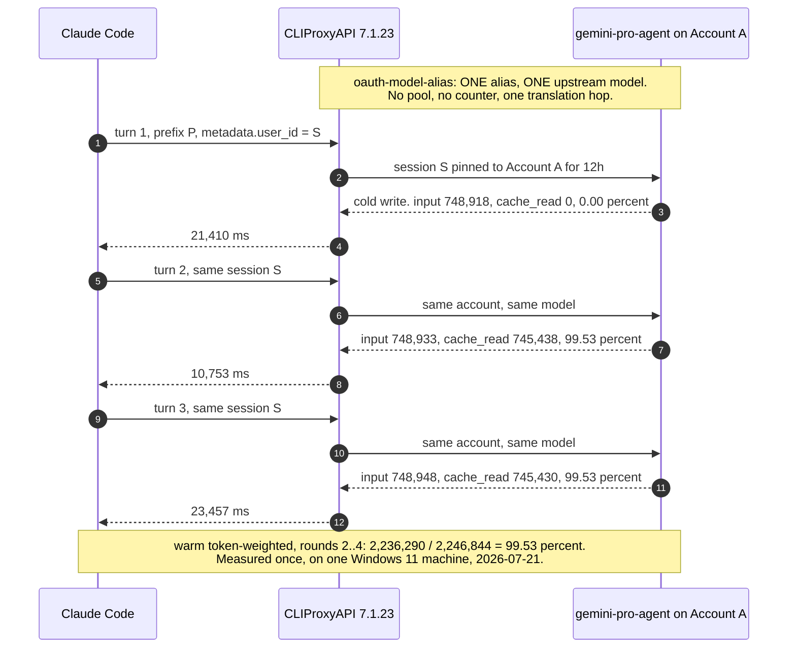

# Architecture diagrams

Three diagrams, in the order they matter:

1. [The request path](#1-the-request-path) - what talks to what, and who wrote each box.
2. [Where the prompt cache actually lives](#2-where-the-prompt-cache-actually-lives) - the
   single fact the whole project is built around.
3. [The failure mode we fixed](#3-the-failure-mode-we-fixed) - a two-member model pool
   rotating per request, versus the direct 1:1 alias.

Companion: [cache-lifecycle.md](cache-lifecycle.md) - cold round 1 versus warm rounds 2..N,
with the measured numbers.

**Ownership, since it decides who deserves credit and who to file bugs against:**

| Colour in the diagrams | Who wrote it | Examples |
|---|---|---|
| Blue - **ours** | This repository, MIT, by shark0120 | `tools/cache_bench.py`, `tools/cache_stats_sidecar.py`, `tools/claude_shim.py`, `gateway/`, `deploy/` |
| Purple - **third party** | [CLIProxyAPI](https://github.com/router-for-me/CLIProxyAPI), MIT, Luis Pater / Router-For.ME | the Go engine on `:8318` - **we did not write it and this project is useless without it** |
| Green - **client you already run** | Anthropic / OpenAI | Claude Code, Codex |
| Grey - **upstream vendor** | Google / xAI / OpenAI | the model APIs, and the prompt caches |

Nothing in this repository redistributes CLIProxyAPI. You bring your own binary. See
[Credits](../../README.md#credits-and-attribution).

---

## 1. The request path

### 1a. Local, single machine (the configuration every number in this repo was measured on)



Notes on the boxes that are easy to get wrong:

* **`claude_shim.py` is temporary.** It exists only because CLIProxyAPI 7.1.23's antigravity
  *streaming* translator passes `messages[].role` through verbatim, and Claude Code 2.1.x and
  later inject a `role: "system"` message in the middle of the array. Upstream fixed this in
  **v7.2.93**. On 7.2.93 or newer, delete the shim and point `ANTHROPIC_BASE_URL` at `:8318`.
  Codex never needed it, which is why its arrow goes straight to the engine.
* **`cache_bench.py` deliberately never touches the management queue.** The queue is
  consume-on-read; two readers split the records and both report confidently wrong numbers. The
  benchmark reads usage off the HTTP responses it made itself. Exactly one sidecar drains the
  queue, and it takes a loopback-port lock so a second copy fails loudly.
* **The engine holds no cache.** It is a router and a translator. See diagram 2.

### 1b. Public deployment (`deploy/docker-compose.yml`)

Read [`docs/OPERATING_A_PUBLIC_SERVICE.md`](../OPERATING_A_PUBLIC_SERVICE.md) before running
this. Pooled personal OAuth accounts must never back a public service.



Two structural properties, both deliberate:

* **Only Caddy publishes a port.** The gateway and the engine have no `ports:` key at all, so
  Docker never installs a host DNAT rule for them. They are unreachable from the internet even
  if the host firewall is later misconfigured.
* **Caddy is not on the backend network.** A compromised edge cannot reach the engine directly;
  it can only talk to the gateway, which is where authentication, quotas and the spend cap live.

---

## 2. Where the prompt cache actually lives

This is the load-bearing fact of the entire project, and it is the reason every routing setting
in the README is set the way it is.

**The prompt cache is not in this repository, and it is not in the engine.** It is at the
upstream provider, and it is scoped **per account and per model**. A proxy cannot cache anything
on your behalf. All it can do is make sure consecutive requests in one conversation reach the
same account and the same model.



Read the diagram as a cache key: **`(account, model)`**. Change either component and you are
looking at a different cache entry, which is cold, which costs a full write of the whole prefix.
That single sentence explains three settings:

| Setting | Value | Why, in cache terms |
|---|---|---|
| `routing.session-affinity` | `true` (shipped default: `false`) | Without it, consecutive turns can land on different accounts. Different account, different cache entry, cold. |
| `routing.session-affinity-ttl` | `12h` (shipped default: `1h`) | The binding is a sliding window. One work day of one long session stays on one account. |
| `routing.strategy` | `fill-first` (shipped default: `round-robin`) | The session-to-credential table is in memory, so an engine restart empties it. `fill-first` deterministically re-picks the first healthy credential - usually the same one, cache still warm. `round-robin` spreads restarts across accounts and pays a cold write each time. **Reasoned from documented strategy semantics; we did not benchmark restart behaviour.** |
| `oauth-model-alias` 1:1 | one alias, one upstream model | Keeps the model half of the key constant. This is diagram 3. |

---

## 3. The failure mode we fixed

**Status: the mechanism is Verified from CLIProxyAPI 7.1.23 source and confirmed present in the
binary we ran. The ~50% ceiling that follows from it is *reasoned*, not measured - we never ran a
controlled pool-versus-direct A/B.** Full evidence, including the symbol counts out of the
shipped `.exe`, is in [FINDINGS.md](../FINDINGS.md#finding-1-a-two-member-model-pool-rotates-per-request-and-ignores-your-routing-policy).

### 3a. Broken: one alias, two upstream model names

In an `openai-compatibility` pool, the upstream model for each request is chosen by a **global
rotating counter** in `sdk/cliproxy/auth/conductor.go` (`nextModelPoolOffset`, state in
`modelPoolOffsets`, keyed by `openAICompatModelPoolKey`). The key is the **pool**. No session
identifier, conversation id, credential id or `metadata.user_id` participates in the choice - so
the rotation ignores `routing.strategy` **and** ignores `session-affinity`, and you can have both
set correctly and still bounce.



Two aggravating factors that were specific to our deployment, and are both easy to reproduce by
accident:

* **The self-loop dropped the session id.** The pool's `base-url` pointed back at the same proxy
  (`http://127.0.0.1:8318/v1`), so a Claude-format request was translated to OpenAI format and
  re-entered the engine. The Claude-to-OpenAI translation maps only `user`; `metadata.user_id` -
  where Claude Code puts its session identifier - does not survive the hop. Session affinity then
  degrades to a hash of the first few messages, which can bind the same conversation to a
  *different account*, whose cache is cold. Two translation hops also burn CPU on every
  multi-hundred-thousand-token request.
* **The second member did not exist.** `gemini-3-pro-high` was never registered by the
  `antigravity` provider on this build, so every request that rotated onto it returned
  **502 "unknown provider"**. That is the only reason the problem was visible at all. **A pool
  whose members are all valid fails silently - you just quietly pay double.**

### 3b. Fixed: a direct 1:1 alias on the provider channel



The configuration change, in full:

```yaml
routing:
  strategy: "fill-first"        # shipped default: "round-robin"
  session-affinity: true        # shipped default: false
  session-affinity-ttl: "12h"   # shipped default: "1h"

oauth-model-alias:
  antigravity:
    - name: "gemini-pro-agent"
      alias: "yangble5"
      fork: true
```

What the direct alias buys, concretely: one translation hop instead of two; the real Claude Code
session id survives to the credential-pinning logic; a single stable upstream model, so there is
exactly one cache entry to hit; and Gemini's `cachedContentTokenCount` surfaces to the client as
`cache_read_input_tokens`, which is the only reason any of this is measurable from outside.

---

## Every number in these diagrams, and where it comes from

| Number | Source | Status |
|---|---|---|
| 748,918 prompt tokens (round 1) | upstream `promptTokenCount`, relayed as `input_tokens` | Measured, single run |
| 748,933 / 748,948 prompt tokens (rounds 2, 3) | same | Measured, single run |
| 745,438 / 745,430 cache reads (rounds 2, 3) | same | Measured, single run |
| 0 cache read on round 1, 0.00% | cold write, true by construction | Measured |
| 99.53% warm, token-weighted | `2,236,290 / 2,246,844` over rounds 2..4 | Measured, **warm rounds only** |
| 21,410 ms / 10,753 ms / 23,457 ms | round 1 / 2 / 3 wall clock | Measured once. **Not a benchmark** - round 3 was slower than the cold round while reading 99.53% from cache. |
| ~50% pool ceiling | reasoned from the rotation mechanism | **Reasoned, never measured** |
| 502 on ~half of pooled requests | observed in our deployment | Observed, specific to a pool member that did not exist on this build |
| `nextModelPoolOffset`, `modelPoolOffsets` present in the 7.1.23 binary | byte-count over `cli-proxy-api.exe` (43,395,584 bytes) | Verified (source/binary) |
| Ports 8318 / 8319 / 8320 / 8000 / 80 / 443 | engine / sidecar lock / shim / gateway / Caddy | Configuration, not a measurement |

Caveats that apply to every figure above, without exception: **one Windows 11 machine, one run
per configuration, 2026-07-21, no repetitions, no error bars, no cross-provider comparison.**
The 99.53% covers warm rounds only; round 1 of every session you ever start is 0%. Folding the
cold round into this run gives 74.6%, which is really a measurement of how many rounds we chose
to run. And nothing routed through this proxy performs a live web search - measured the same day,
the Gemini upstream said the year was 2024 and the Grok upstream said 2025.

Methodology precise enough to refute: [BENCHMARK.md](../BENCHMARK.md).
