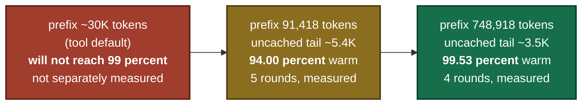
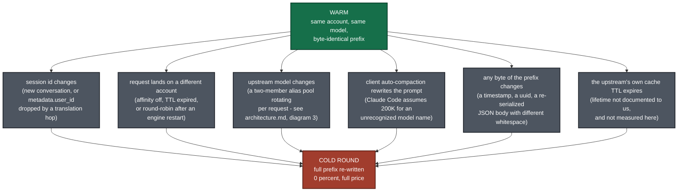

# Prompt-cache lifecycle: one cold round, then warm rounds

What actually happens across a session, with the numbers we measured rather than the numbers we
would like. Companion to [architecture.md](architecture.md), which shows *where* the cache lives
and *why* the routing settings are what they are.

**The one caveat to carry through the whole page: the first request of every session is always
cold, 0%, a full write of the entire prefix. No configuration removes it. The 99.53% headline is
rounds 2 onward.**

All figures below come from a single run on **2026-07-21**, on **one Windows 11 machine**,
against Gemini through CLIProxyAPI 7.1.23's `antigravity` OAuth channel:

```bash
python tools/cache_bench.py --model yangble5 --prefix-tokens 600000 --rounds 4
```

---

## The sequence

```mermaid
sequenceDiagram
    autonumber
    participant BN as tools/cache_bench.py
    participant EN as CLIProxyAPI engine :8318
    participant UP as Gemini via antigravity, Account A
    participant CA as Prompt cache for Account A plus gemini-pro-agent

    Note over BN,CA: ROUND 1 - COLD. True by construction, not by failure.<br/>Every session you ever start pays exactly one of these.

    BN->>EN: POST /v1/messages, 748,918 tokens, metadata.user_id = cache-bench-fixed-session
    EN->>UP: forwarded, credential pinned by session affinity for 12h
    UP->>CA: nothing to read. write the whole 748,918-token prefix.
    UP-->>EN: usage: input_tokens 748,918, cache_read_input_tokens 0
    EN-->>BN: round 1: cached 0, ratio 0.00 percent, 21,410 ms

    Note over BN,CA: ROUNDS 2..4 - WARM. Prefix is byte-identical;<br/>only the conversation tail grew, by exactly 15 tokens per round.

    BN->>EN: round 2, 748,933 tokens, same session id
    EN->>UP: same account, same model. one cache entry, hit.
    CA-->>UP: 745,438 tokens served from cache
    UP-->>EN: cache_read 745,438, uncached tail 3,495
    EN-->>BN: round 2: 99.53 percent, 10,753 ms

    BN->>EN: round 3, 748,948 tokens, same session id
    CA-->>UP: 745,430 tokens served from cache
    UP-->>EN: cache_read 745,430, uncached tail 3,518
    EN-->>BN: round 3: 99.53 percent, 23,457 ms

    BN->>EN: round 4, 748,963 tokens, same session id
    CA-->>UP: 745,422 tokens served from cache
    UP-->>EN: cache_read 745,422, uncached tail 3,541
    EN-->>BN: round 4: 99.53 percent, 22,381 ms

    Note over BN,CA: warm token-weighted = 2,236,290 / 2,246,844 = 99.53 percent<br/>fold the cold round back in and the same run reports 74.6 percent
```

---

## The raw records

Nothing here is averaged, smoothed or reordered. These are the per-request records the engine
emitted, captured by `tools/cache_stats_sidecar.py`.

| Round | Prompt tokens | `cache_read` | Hit | Uncached tail | Latency |
|---:|---:|---:|---:|---:|---:|
| 1 (cold) | 748,918 | 0 | 0.00% | 748,918 | 21,410 ms |
| 2 | 748,933 | 745,438 | 99.53% | 3,495 | 10,753 ms |
| 3 | 748,948 | 745,430 | 99.53% | 3,518 | 23,457 ms |
| 4 | 748,963 | 745,422 | 99.53% | 3,541 | 22,381 ms |

```
warm token-weighted hit rate
  = (745,438 + 745,430 + 745,422) / (748,933 + 748,948 + 748,963)
  = 2,236,290 / 2,246,844
  = 0.99530
```

---

## Why the uncached tail stays roughly constant

The tail is not a fraction of the prompt. It is **whatever the conversation added since the last
request**, plus fixed per-request overhead. In this run the prompt grew by exactly 15 tokens per
round, and the measured uncached remainder sat at 3,495 / 3,518 / 3,541 tokens - about 3.5K,
regardless of the fact that the prefix was 749K.

That is why the *ratio* is prefix-size dependent, and it is the single most important thing to
understand before quoting the headline anywhere:



The 91K run, in full, same tooling and same session discipline
(`python tools/cache_bench.py --prefix-tokens 75000 --rounds 5`):

| Round | Prompt tokens | `cache_read` | Hit |
|---:|---:|---:|---:|
| 1 (cold) | 91,418 | 0 | 0.00% |
| 2 | 91,433 | 85,984 | 94.04% |
| 3 | 91,448 | 85,976 | 94.02% |
| 4 | 91,463 | 85,969 | 93.99% |
| 5 | 91,478 | 85,961 | 93.97% |

Warm token-weighted: `343,890 / 365,822` = **94.00%**.

**Do not quote 99.53% as a universal number.** It is what this upstream's cache granularity does
at a ~749K prefix, on one machine, on one afternoon.

---

## What breaks the warm state

Each of these sends you back to a cold round, and the first three are configuration mistakes
rather than upstream behaviour:



`E5` is why `tools/claude_shim.py` forwards an untouched body **byte for byte**:

```python
# tools/claude_shim.py
if b'"system"' not in body:
    return body        # byte-identical passthrough
```

A "harmless" JSON round-trip on every request would change whitespace, change the cache key, and
quietly have cost us the entire 99.53% result.

---

## Honest reading of the numbers

* **Warm-only.** 99.53% covers rounds 2-4. Round 1 is 0%. Folding it in gives **74.6%** for this
  run - and that number is a function of `--rounds`, not of the cache. Run 40 rounds and it
  climbs toward 97% having measured nothing new. Both numbers come from the same four records;
  the tool prints the cold round separately so you can compute whichever you need.
* **Short sessions get the cold number, not the warm one.** If your workload opens a fresh
  conversation per task, you pay a cold write every time and the warm figure is close to
  irrelevant to you. Prompt caching is a long-session optimisation.
* **Latency is an anecdote, not a benchmark.** Round 2 was roughly 2x faster than cold
  (10,753 ms vs 21,410 ms). Rounds 3 and 4 were **slower than the cold round** (23,457 ms and
  22,381 ms) while reading 99.53% of their prompt from cache. Single run, shared upstream, no
  control over provider-side load. Caching reduces cost predictably; on this evidence it does not
  reduce wall-clock time predictably.
* **One machine, one run, one afternoon.** No repetitions, no confidence intervals, no
  cross-provider comparison. Upstream providers change caching granularity without notice; a
  number measured in July 2026 may not survive to August. `cache_bench.py` ships precisely so you
  can re-measure instead of trusting us.
* **This costs real money.** The 4-round 749K run moved **2,995,762 prompt tokens** through a
  billed upstream. Start with the default `--prefix-tokens 30000` to confirm the plumbing works.

Methodology, including the denominator normalisation across two incompatible `input_tokens`
conventions: [BENCHMARK.md](../BENCHMARK.md). Evidence and status labels for every claim:
[FINDINGS.md](../FINDINGS.md).
